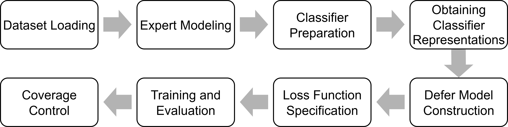

<p align="center">
<b><ins>H</ins>uman-<ins>A</ins>I <ins>C</ins>omplementarity Toolbox</b>
</p>

[](https://opensource.org/licenses/BSD-3-Clause)

**HAIC Toolbox** is a programming library to simplify development, training and evaluation of models and methods for human-AI
complementarity, i.e. machine learning models that are designed to complement humans (and be complemented by them).
Practically, it means that these models account for their own "imperfection" as well as "imperfection" of human experts.
A prominent example of such models are the so-called learning to defer (L2D) models.

---

## Key Features

* Wrappers for datasets with real and synthetic human expert annotations (e.g., CIFAR-10H[^1], Galaxy Zoo[^2], FiFAR[^3]).
* Probabilistic expert models (confusion-matrix, uniform, class-based), allowing one to validate human-AI complementarity algorithms
  using arbitrary datasets.
* Predictive models with deferral heads and feature interception via `InterceptorNetwork`.
* Deferral policies: threshold-based heuristics and trainable deferral heads.
* Loss functions for end-to-end or post-hoc deferral training (Softmax-parametrization[^4], One-vs-All[^5], rejector), including one expert
  as well as multi-expert settings
* Variety of metrics, from simple coverage and accuracy to integrated metrics (DEV[^6], AC-AUC, nAC-AUC) and coverage control utilities.

---

## How the library works

The core idea of the HAIC Toolbox is to provide a modular workflow for experimenting with human–AI collaboration.  

<p align="center">
  
</p>

Typical workflow:

1. **Dataset loading** – load datasets with real or synthetic expert annotations.  
2. **Expert modeling** – simulate annotators or wrap human annotations.  
3. **Classifier preparation** – choose and initialize a base classifier (e.g., ResNet).  
4. **Obtaining classifier representations** (optional) – extract intermediate features (via `InterceptorNetwork`) from the base classifier.  
5. **Defer model construction** – build a deferral model with an additional deferral head (e.g., an MLP with K+1 outputs).  
6. **Loss function specification** – select a loss function (e.g., OvA, softmax-param., rejector).  
7. **Training and evaluation** – train with expert labels and assess performance.  
8. **Coverage control** (optional) – analyze coverage–accuracy trade-offs and calibrate deferral policy.  


---

## How to Use

This section demonstrates how to train and evaluate a deferral model using the HAIC Toolbox.  
The example is based on the CIFAR-10H dataset with real human annotations, using the One-vs-All (OvA)[^5] loss for learning to defer.

### 1. Load the dataset with human annotations
```
from haic.datasets import Cifar10h

cifar_transform = torchvision.transforms.Compose([
    torchvision.transforms.ToTensor(),
    torchvision.transforms.Normalize((0.4914, 0.4822, 0.4465), 
                                     (0.2023, 0.1994, 0.2010)),
])

dataset = Cifar10h(human_model='sample', transform=cifar_transform)
```

The dataset provides both ground-truth labels and sample-level human annotations.

### 2. Extract internal representations from a pretrained model
```
import torch
from haic.models import InterceptorNetwork, GlobalAvgPool2dConnector

resnet56_model = torch.hub.load("chenyaofo/pytorch-cifar-models", "cifar10_resnet56", pretrained=True)

connectors = [
    (resnet56_model.avgpool, torch.nn.Flatten())
]

imodel = InterceptorNetwork(resnet56_model, connectors=connectors, return_connectors_only=True)
```

The `InterceptorNetwork` extracts activations from intermediate layers of the pre-trained base classification model
and makes them available as inputs for models with deferral heads.

### 3. Build a dataset with features, expert labels, and ground truth
```
from haic.data import (
    predict,
    extract,
    ProjectDataset
)

data = torch.utils.data.TensorDataset(
    predict(imodel, ProjectDataset(dataset, (0, ))),    # internal representations
    extract(tmp, 1),    # expert labels
    extract(tmp, 2),    # ground truth
)

train_data, test_data = random_split(data, [0.7, 0.3])
```
The dataset is converted into triplets (X, m, y),
where X are model features, m are expert annotations, and y are ground-truth labels.
This dataset is then split into training and testing subsets.

### 4. Define a simple predictive model with a deferral head
```
from haic.models import MLP

model = MLP([64, 10+1])  # 10 classes + 1 deferral option
```
The final output layer has K+1 units: K for the original classes and one additional logit for deferral,
which is typical for learning to defer models and respective loss functions. However, as HAIC is compatible
with PyTorch programming library, the deferral network architecture can be arbitrary.

### 5. Train the model using the OvA loss

```
from haic.losses import ova_loss
from haic.trainers import train
from haic.joint import get_joint_model_train_step

train(model,
      ova_loss,
      data=train_data,
      val_data=test_data,
      batch_size=500,
      train_step=get_joint_model_train_step(10, 1),
      lr=1e-3,
      weight_decay=1e-2,
      max_iter=1000,
      early_stopping_patience=20)
```

The library includes a utility function to simplify model training, supporting most widely used settings
and features (e.g., CUDA support, early stopping based on evaluation loss, iteration count and batch size
control, etc.). The training process can be tuned by providing a user train_step function, but the library
contains several built-in training step functions for a number of cases. Of course, most of the parameters
in the example above are optional and have reasonable default values.

### 6. Evaluate with coverage–accuracy curves

```
import haic
from haic.utils import extract

def score(logits):
    sm = F.softmax(logits, -1)
    return sm[:,:-1].max(-1).values - sm[:,-1]

logits = predict(model, ProjectDataset(test_data, (0, 2)))

c, a = haic.scoring.coverage_accuracy_curve(
    score(logits),
    haic.joint.model_predictions(logits),
    extract(test_data, 1),  # expert labels
    extract(test_data, 2)   # ground truth
)
```
The coverage–accuracy curve reveals how system performance changes as more or fewer instances are deferred.

## Installation

You can view a list of required dependencies in the [requirements.txt](https://github.com/cais-lab/haic/blob/main/requirements.txt) file. You can also install them as follows:

```bash
git clone https://github.com/cais-lab/haic.git
cd haic
python3 -m venv venv
source venv/bin/activate
pip install -r requirements.txt
```

## Funding
The HAIC Toolbox was developed in the scope of the project 24-21-00337, funded by the Russian Science Foundation (RSF).


[^1]: J. Peterson, R. Battleday, T. Griffiths, O. Russakovsky. Human uncertainty makes classification more robust. Proceedings of the IEEE International Conference on Computer Vision, vol. 2019-Octob, pp. 9616–9625, 2019.
[^2]: S. Bamford et al. Galaxy Zoo: the dependence of morphology and colour on environment. https://arxiv.org/abs/0805.2612
[^3]: J. V. Alves, D. Leitão, S. Jesus, et al. FiFAR: A Fraud Detection Dataset for Learning to Defer. p. 2023.
[^4]: H. Mozannar, D. Sontag. Consistent estimators for learning to defer to an expert. In: 37th International Conference on Machine Learning, ICML 2020. pp. 7033–7044 (2020).
[^5]: R. Verma, E. Nalisnick. Calibrated Learning to Defer with One-vs-All Classifiers. In: Proceedings of the 39 th International Conference on Machine Learning (2022).
[^6]: S.J. Lemmer, J.J. Corso. Evaluating and Improving Interactions with Hazy Oracles. In: Proceedings of the 37th AAAI Conference on Artificial Intelligence, AAAI 2023. pp. 6039–6047 (2023).
